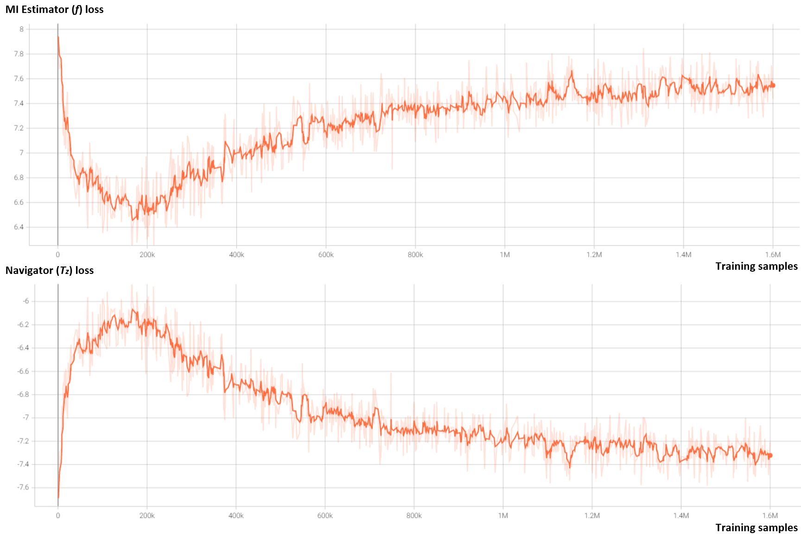
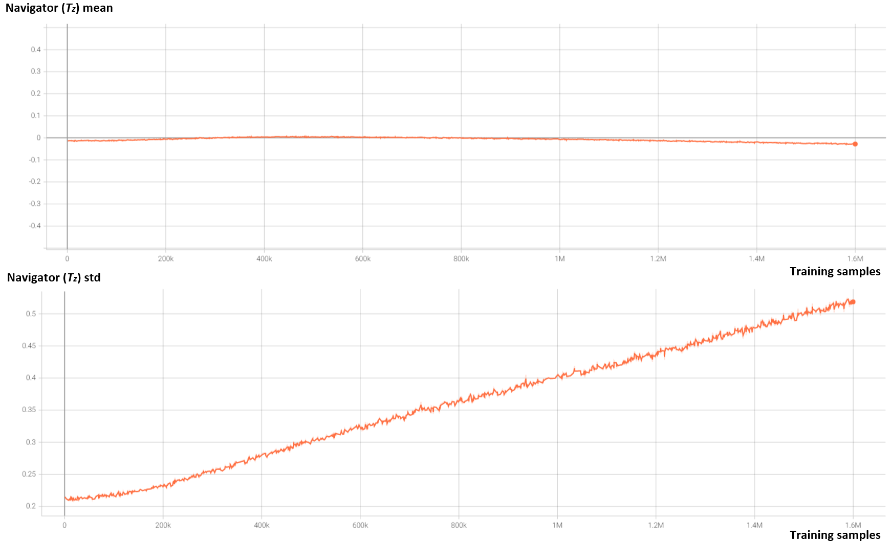

# COP-Gen

This repo is the official code of COP-Gen, for reproducing the results of our paper.


## Requirements

- Linux
- Python 3.8
- PyTorch 1.7.1


## Navigator Training
```bash
cd cop_gen
CUDA_VISIBLE_DEVICES=0,1,2,3 python train_navigator_bigbigan_optimal.py --simclr_aug --batch_size BATCH_SIZE
```
where: 
- `simclr_aug` is set to use SimCLR data space augmentation by default.
- `BATCH_SIZE` is set as 176 in the paper, which is the largest value that can be achieved on 4 NVIDIA 2080 Ti GPUs.


Beolow gives the training losses of the navigator and the mutual infomation estimator.



We also monitor the mean and std of the navigator during training as an auxiliary monitor signal for terminating the training process,
as shown in the figure below.

A simple and effective way is to watch the qualtity of generated positive pairs, 
which will be saved at `cop_gen/walk_weights_bigbigan/ckpts/name_of_experiment/images`.



### Note
Since the final performance is affected by the choice of navigator checkpoint (i.e., when to terminate the training),
we here provide our [trained navigator checkpoint](./PretrainedModels/navigator_bigbigan128/w_COPGen_pretained.pth) for the following experiments, 
to reproduce quantitative and qualitative results in the paper.


## Dataset Generation
```bash
cd cop_gen
CUDA_VISIBLE_DEVICES=0 python generate_dataset_bigbigan_optimal.py --dataset DATASET_TYPE --out_dir OUT_DIR --walker_path /path/to/pretained/navigator
```
where: 
- `DATASET_TYPE` is set to `1k` (`100`) for ImageNet-1K (ImageNet-100) scale pretraining dataset.
- `OUT_DIR` is the path to save the generated dataset.


## Contrastive Learning

```bash
# contrastive learning on COP-Gen generated dataset
CUDA_VISIBLE_DEVICES=0,1 python main_unified.py \
  --method=SimCLR \
  --dataset=bigbigan_sweet \
  --data_folder=/path/to/generated/dataset \
  --save_folder=/path/to/save/contrastive/encoders \
  --batch_size=BATCH_SIZE \
  --epochs=100 \
  --learning_rate=LR \
  --cosine
```
where: 
- `BATCH_SIZE` is set as 224 in the paper, which is the largest value that can be achieved on 2 NVIDIA 2080 Ti GPUs.
- `LR` is set as `0.03 * BATCH_SIZE / 256 = 0.02625` in the paper.


## Linear Evaluation
```bash
CUDA_VISIBLE_DEVICES=0,1 python main_linear.py \
  --ckpt=/path/to/trained/contrastive/encoders \
  --data_folder=/path/to/ImageNet1k \
  --dataset=bigbigan_sweet \
  --save_folder=/path/to/save/linear/models \
  --batch_size=BATCH_SIZE \
  --epochs=60 \
  --learning_rate=LR \
  --cosine
```
where: 
- `BATCH_SIZE` is set as 224 to align with the pretraining stage.
- `LR` is set as `2 * BATCH_SIZE / 256 = 1.75`.


